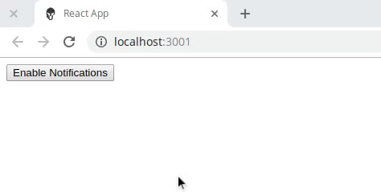

# React push-notification button 

After you register a service worker, this button will be able to request the user permission to receive notifications.



## Usage

To trigger a push message an application needs to make a POST request to a push service following the [web push protocol](https://tools.ietf.org/html/draft-ietf-webpush-protocol). To use push across all browsers you need to use [VAPID](https://tools.ietf.org/html/draft-thomson-webpush-vapid) (a.k.a application server keys) which basically requires setting a header with a value proving your application can message a user. To send data with a push message, the data needs to be [encrypted](https://tools.ietf.org/html/draft-ietf-webpush-encryption) and specific headers added so the browser can decrypt the message correctly.

### Generating VAPID keys

You can create a public and private set of application server keys by visiting [web-push-codelab.glitch.me](https://web-push-codelab.glitch.me/) or you can use the [web-push command line](https://github.com/web-push-libs/web-push#command-line) to generate keys by doing the following:

```
$ npm install -g web-push
$ web-push generate-vapid-keys
```

### Component usage

First you will need to install using npm

```
npm install react-push-notification-button
```

or if you use yarn

```
yarn add react-push-notification-button
```

then import the component in your project

```javascript
import PushButton from 'react-push-notification-button'
```

and use where you need

```jsx
<PushButton
  publicServerKey={YOUR_PUBLIC_SERVER_KEY}
  onSubscribe={subscription => console.log(subscription)}
  onUnsubscribe={subscription => console.log(subscription)}
/>
```

any other props will be passed to `<button>`

If you pass the prop `component` then the default `<button>` will be changed by
your component:

```jsx
// Button.js
function Button() {
  return <div>custom button</div>
}
```

```jsx
// import and use Button.js as custom component
<PushButton
  publicServerKey={YOUR_PUBLIC_SERVER_KEY}
  onSubscribe={subscription => console.log(subscription)}
  onUnsubscribe={subscription => console.log(subscription)}
  component={Button}
/>
```

You can check the [demo](src/demo/App.js) for more examples or you can see it running in our [Codesandbox](https://codesandbox.io/s/react-push-notification-buttondemo-97lu4)

### Response

this is the callback response of `onSubscribe`

```json
{
  "endpoint": "<endpoint>",
  "expirationTime": null,
  "keys": {
    "p256dh": "<token>",
    "auth": "<token>"
  }
}
```

### Props

| prop            | description                                       | type                     |          |
| --------------- | ------------------------------------------------- | ------------------------ | -------- |
| publicServerKey | VAPID key                                         | string                   | required |
| onSubscribe     | Return the subscription                           | callback function        |          |
| onUnsubscribe   | Return the subscription                           | callback function        |          |
| permissionState | Return the notification state (true|false)        | callback function        |          |
| texts           | The texts that may appear in button               | object                   |          |
| component       | Custom component used insted of default button    | React Component          |          |
| preview         | Shows one notification right after subscription   | boolean                  |          |
| previewOptions  | The options to customize the preview              | object { title, options} |          |
